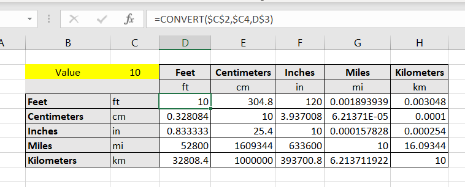

# How to use Excel to convert different measure units

In your daily life, you may need to know [how many ounces in a cup](https://www.calculatorful.com/ounces-to-cups) or how to [convert cups to grams](https://www.calculatorful.com/cups-to-grams)

There is an useful function in Excel that provides such capability. Excel’s CONVERT function can do many type of conversion that you need. 

```
CONVERT(number,from_unit,to_unit)
```

The function requires three arguments: 

```
Number     is the value in from_units to convert.

From_unit     is the units for number.

To_unit     is the units for the result. CONVERT accepts the following text values (in quotation marks) for from_unit and to_unit.
```

For example, to convert 100 [kilometers into miles](https://www.calculatorful.com/kilometers-to-miles) , the formular is as follow:

```
=CONVERT(100,"km", "mi")
```

Or to convert 100 [gallons into quarts](https://www.calculatorful.com/gallons-to-quarts), we can use this formular:

```
=CONVERT(100,"gal", "qt")
```

Note: the conversion codes must be entered in the valid format as defined by its document

# Sample
Create conversion table or a matrix to calculate a value in different unit

